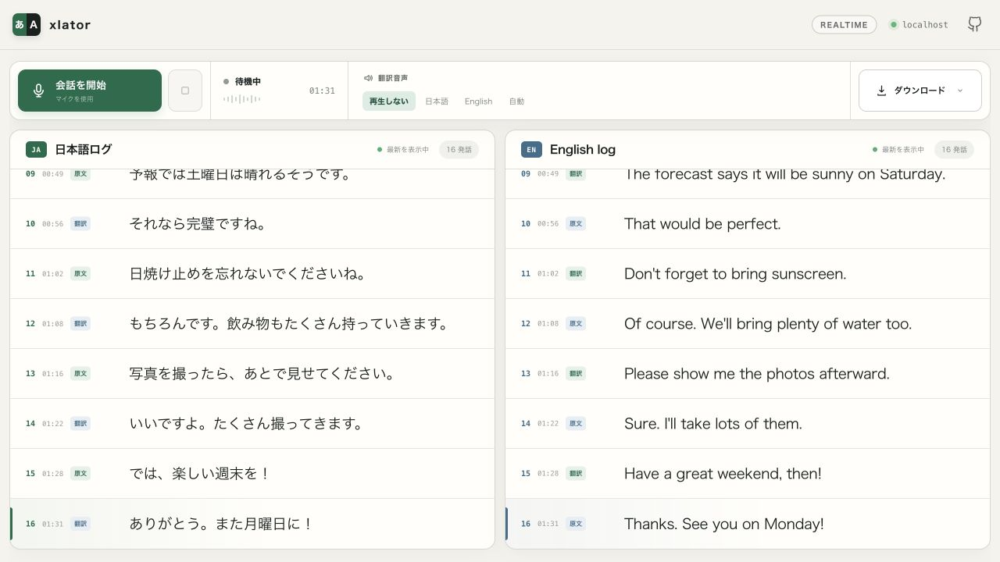

# xlator

A translation tool that runs locally.



```bash
npm install
cp .env.example .env.local
# Add your OpenAI API key in the file opened by the command below.
open -t .env.local
npm run dev
open http://localhost:3000
```
